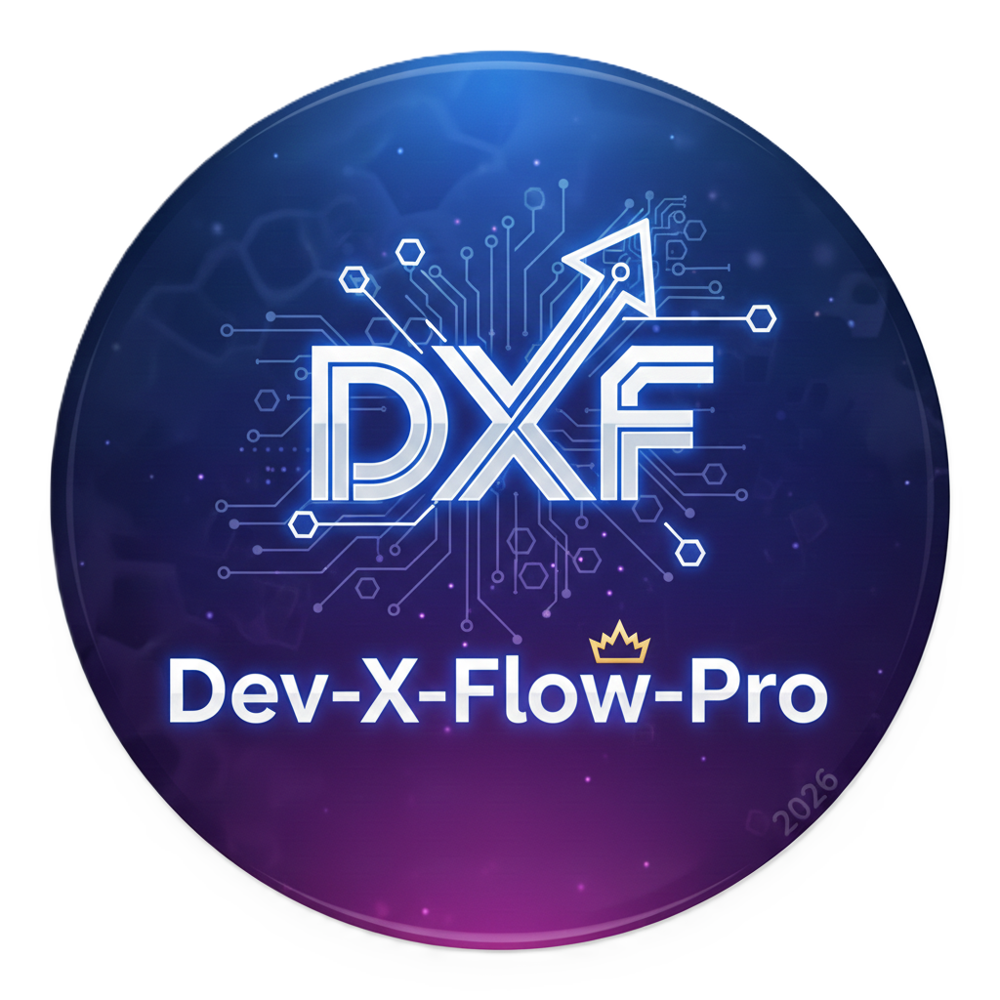

# Dev-X-Flow-Pro

<p align="center">
  
</p>

<p align="center">
  <strong>🚀 Professional Git GUI with AI-Powered Commit Messages & Database Management</strong>
</p>

<p align="center">
  <a href="#features">Features</a> •
  <a href="#installation">Installation</a> •
  <a href="#usage">Usage</a> •
  <a href="#ai-features">AI Features</a> •
  <a href="#developers">Developers</a>
</p>

---

## ✨ Features

### 🎨 Modern Dark UI
- Sleek, professional dark theme interface
- Tabbed navigation for organized workflow
- Intuitive controls and visual feedback

### 🤖 AI-Powered Commit Messages
- **7 AI Providers Supported:**
  - OpenAI (GPT-3.5-turbo)
  - Google Gemini
  - Anthropic Claude
  - Moonshot Kimi
  - ChatGLM
  - DeepSeek
  - Azure OpenAI
- Generate contextual commit messages based on your code changes
- Configurable API keys and model selection

### 📊 Repository Management
- **Status & Commit Tab:** View changes, stage files, commit with AI assistance
- **History Tab:** Browse commit history with detailed logs
- **Remote Tab:** Manage remotes, pull/merge/rebase operations
- **Stash Tab:** Save and restore work-in-progress

### 💻 Integrated Terminal
- Project-type detection (Laravel, Node.js, Python)
- Command history and suggestions
- Quick access to common commands

### 🐛 Debug Tools
- Laravel log monitoring
- Auto-refresh logs
- Real-time error tracking

---

## 📥 Installation

### Option 1: Download Pre-built Executable (Recommended)
1. Download `Dev-X-Flow-Pro-v7.0.exe` from the [Releases](https://github.com/YEXIU21/Dev-X-Flow-Pro/releases) page
2. Run the executable - no installation required!

### Option 2: Run from Source
```bash
# Clone the repository
git clone https://github.com/YEXIU21/Dev-X-Flow-Pro.git

# Navigate to project directory
cd Dev-X-Flow-Pro

# Install dependencies
pip install requests pillow

# Run the application
python "Dev-X-Flow-Pro/Dev-X-Flow-Pro.py"
```

### Requirements
- **Windows:** Windows 10/11
- **Git:** Must be installed and available in PATH
- **Python:** 3.8+ (if running from source)

---

## 🚀 Usage

### Getting Started
1. **Launch Dev-X-Flow-Pro**
2. **Select Repository:** Click "Browse" or enter repository path
3. **Initialize (if needed):** Click "⚡ Init Repo" for new repositories

### Making Commits with AI
1. Stage your changes with "1. Stage All"
2. Click "✨ AI Generate" next to the commit message field
3. Configure your AI provider API key (first time only)
4. Review the AI-generated commit message
5. Click "2. Commit" and "3. Push"

### Quick Workflow
Use the **"⚡ Sync to Main"** button for:
- Commit → Merge → Push → Pull in one action

---

## 🤖 AI Configuration

### Supported Providers

| Provider | Model | Get API Key |
|----------|-------|-------------|
| **OpenAI** | GPT-3.5-turbo | [platform.openai.com](https://platform.openai.com/api-keys) |
| **Google Gemini** | gemini-pro | [makersuite.google.com](https://makersuite.google.com/app/apikey) |
| **Anthropic Claude** | claude-3-haiku | [console.anthropic.com](https://console.anthropic.com/settings/keys) |
| **Moonshot Kimi** | moonshot-v1-8k | [platform.moonshot.cn](https://platform.moonshot.cn/console/api-keys) |
| **ChatGLM** | glm-4 | [open.bigmodel.cn](https://open.bigmodel.cn/usercenter/apikeys) |
| **DeepSeek** | deepseek-chat | [platform.deepseek.com](https://platform.deepseek.com/api_keys) |
| **Azure OpenAI** | gpt-35-turbo | [portal.azure.com](https://portal.azure.com) |

### Setup
1. Click "✨ AI Generate"
2. Select "Yes" to configure API
3. Choose your preferred provider
4. Enter API key
5. (Optional) Enter custom model name
6. Save configuration

---

## 🛠️ Project Structure

```
Dev-X-Flow-Pro/
├── Dev-X-Flow-Pro/
│   ├── Dev-X-Flow-Pro.py          # Main application file
│   ├── AI_COMMIT_MESSAGE_DOCS.md # AI feature documentation
│   ├── app.ico                    # Application icon
│   ├── window_icon.png            # Window icon (32x32)
│   └── devXflowpro.png            # Logo for splash screen
├── exe/                           # Build output folder
├── .gitignore
└── README.md                      # This file
```

---

## 👨‍💻 Developers

<p align="center">
  <strong>Built with ❤️ by</strong>
</p>

<p align="center">
  <a href="https://github.com/StefanSalvatoreWP">
    
  </a>
  <a href="https://github.com/YEXIU21">
    
  </a>
</p>

---

## 📄 License

This project is open source. Feel free to use, modify, and distribute.

---

## 🆘 Support

### Common Issues

**Icon not showing in Windows Explorer?**
- Windows caches icons aggressively. Try:
  1. Right-click → Refresh
  2. Clear icon cache: `ie4uinit.exe -show`
  3. Restart Explorer

**AI commit generation not working?**
- Ensure API key is configured (click "✨ AI Generate" → "Yes")
- Check internet connection
- Verify API key validity with provider

**Git commands failing?**
- Ensure Git is installed and in PATH
- Check repository initialization status

### Feature Requests & Bugs

Please open an issue on GitHub for:
- Bug reports
- Feature requests
- Questions about usage

---

<p align="center">
  <strong>🌟 Star this repo if you find it useful!</strong>
</p>

<p align="center">
  <a href="https://github.com/YEXIU21/Dev-X-Flow-Pro/stargazers">
    
  </a>
</p>
